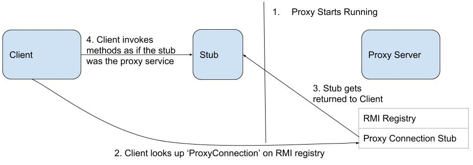

# RedisProxy

## High-level architecture overview.

By utilizing the Remote Method Invocation, I could get the Proxy to make GET or cache requests on the Client's behalf. 
Those requests are defined in a Remote Interface, defined in ProxyServerInterface.java. 
After the server makes those requests, it may update the Redis cache with a predefined parameters: expiry and cache size.
 
## What the code does

### ProxyServerInterface.java
- Defines the methods that the client can invoke in the Proxy

### Proxy.java
- Generates the stub in the RMI Registry so that the Client can invoke methods within using the ProxyServerinterface
- Connects to the JedisInstance class, so that results from the GET request can be stored in the cache as needed. 

### JedisInstance.java
- Manages url-HTTP Response pairs by adding them as GET requests get processed, and deleting them if there's no space or expired.

### Client.java
- Looks up the ProxyConnection stub generated by the Proxy class, and invokes methods that access the Proxy cache and makes GET requests.

### RedisProxyDriverClass.java (in src/test/java)
- Defines five test cases that checks the cache in terms of timing, size, and malformed URLs.
 
## Algorithmic complexity of the cache operations
The cache has _ main methods. I maintain a linkedlist to keep track of the chronological order of the urls, and a map-based structure for the cache.
1. **addToCache(String url, String response)** takes in two parameters and stores the pair.  
**Average Time Complexity: O(1)** if the hash function is designed well.
2. **removeURLSIfNeeded()** removes the oldest element in the linkedlist (O(1) due to queue structure) and uses that value to remove the key-value pair in the Redis cache.  
**Average Time Complexity: O(1)** for the same reason as 1.
3. **findCacheResult(String url)**  checks the Redis cache to see if the url has an entry in the table.  
**Average Time Complexity: O(1)** for the same reason as 1. 
4. **flushCache()** deletes every key-value pair in the Redis Cache.  
**Time Complexity: O(number of keys)** because every existing key has to be operated on.

## Instructions for how to run the proxy and tests
I couldn't get the application running independently without an IDE due inexperience with maven and docker.   

Instructions for running the test cases:
1. Make sure you have java JDK 8 and Netbeans installed. Accept the License Agreement and look for the right operating system to download the bundle [here](http://www.oracle.com/technetwork/java/javase/downloads/jdk-netbeans-jsp-142931.html).  
2. Pull this repository from git using this command: git clone https://github.com/kuannie1/RedisProxy.git
3. Startup Netbeans and open the RedisProxy directory as a project.
4. Navigate to src/test/java and press F6 or the green triangle to run the file. 

## How long you spent on each part of the project
Time spent: About 7 hours a night from June 29th to July 2nd. This time was mostly spent reading tutorials about Jedis, Maven, JUnit, and integrating them into NetBeans or IntelliJ.

Without Time Inflation: 
- Coming up with the design: 30 minutes
- Implementing the RMI and GET request together: 1 hour
- Integrating Jedis into code and environment: 1 hour
- Making Test Cases: 1 hour
- Finalizing README: 30 minutes

Side note: I took a break on July 3rd and 4th due to family celebrations.

## A list of the requirements that you did not implement and why
**Platform and Single-click build and test:** I spent the most time on this, but I couldn't get it to work. I think I have to read manuals and take online courses to familiarize myself with this process.  
**Sequential Concurrent Processing:** I spent hours every night working on making the proxy service independent that I forgot to implement this. I know I can do this after reading into how Jedis Pool works.